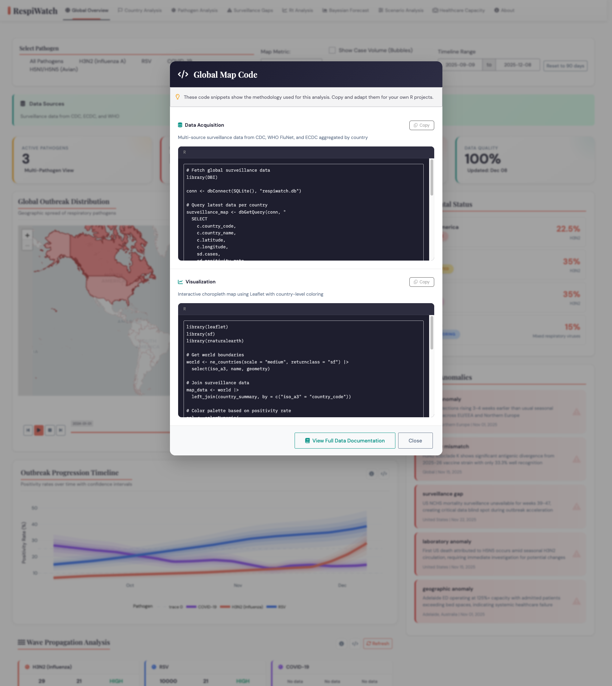

```{r setup, include=FALSE}
options(htmltools.dir.version = FALSE)
knitr::opts_chunk$set(
  fig.retina = 3,
  warning = FALSE,
  message = FALSE
)
library(xaringanExtra)
use_animate_css()
```

class: center, middle, inverse

# Voice-to-Code with Claude

### Building R Projects Through Conversation

.large[R Data Community | December 2024]

---

class: inverse

# A Confession

.pull-left[
## I'm a Python Person

- Primary language: Python
- AI/ML engineering background
- Never written serious R code
- **Total R experience before this: ~0**
]

.pull-right[
## The Challenge

> Can I build production-quality R applications using only voice commands?

*Spoiler: Yes.*
]

---

# What We Built in ~3 Days

.center[
```
┌─────────────────────────────────────────────────────────────┐
│                        DAY 1                                 │
│  Diabetes ML Dashboard (Shiny)                              │
│  • 253K records • AUC 0.82 • Fairness Audit                 │
├─────────────────────────────────────────────────────────────┤
│                        DAY 2                                 │
│  RespiWatch Surveillance Platform (Shiny)                   │
│  • 10+ APIs • Real-time Rt • Bayesian Forecasting          │
├─────────────────────────────────────────────────────────────┤
│                        DAY 3                                 │
│  This Presentation (xaringan) + Quarto Report               │
│  • Custom theme • Live deployment                           │
└─────────────────────────────────────────────────────────────┘
```
]

.footnote[All code generated through voice-to-text conversation with Claude Code]

---

class: inverse, center, middle

# Part 1: The Setup

## Claude Code + R Data Science Skill

---

# The R Data Science Skill

.pull-left[
```
.claude/skills/r-data-science/
├── skill.md        # Core R patterns
└── agents/
    ├── data-wrangler/
    ├── viz-builder/
    ├── stats-analyst/
    ├── dashboard-builder/
    ├── report-generator/
    └── data-storyteller/
```
]

.pull-right[
## What It Provides

- **Tidyverse patterns** baked in
- **ggplot2 best practices**
- **Shiny module architecture**
- **Statistical methods**
- Domain-specific knowledge
]

---

# The 6 Specialized Agents

| Agent | Purpose | Key Capability |
|-------|---------|----------------|
| **Data Wrangler** | Clean & reshape | tidyverse pipelines, joins |
| **Viz Builder** | Create visualizations | ggplot2, publication-quality |
| **Stats Analyst** | Statistical analysis | Hypothesis testing, regression |
| **Dashboard Builder** | Interactive apps | Shiny, bslib, reactive patterns |
| **Report Generator** | Documents | Quarto, R Markdown |
| **Data Storyteller** | Communication | Narrative, audience adaptation |

.center[*Each agent has deep context about R idioms and best practices*]

---

# The /plan Command

.pull-left[
```bash
# In terminal, say:
/plan Build a dashboard that
shows diabetes risk factors
with ML model comparison

# Claude Code:
1. Explores codebase
2. Identifies patterns
3. Creates implementation plan
4. Asks clarifying questions
5. Executes systematically
```
]

.pull-right[
## Why It Matters

- **Structured approach** to complex tasks
- **Parallel exploration** with multiple agents
- **User approval** before changes
- **Clear milestones** tracked

*Not just "write code" — it's collaborative architecture*
]

---

# Voice-to-Code Workflow

.center[
```
┌──────────────┐      ┌──────────────┐      ┌──────────────┐
│   SPEAK      │ ──▶  │   CLAUDE     │ ──▶  │    CODE      │
│   Intent     │      │   Plans      │      │   Executes   │
└──────────────┘      └──────────────┘      └──────────────┘
       │                     │                     │
       ▼                     ▼                     ▼
  "Add a fairness     Spawns agents,        Creates module,
   audit tab"         analyzes code,        tests, integrates
                      proposes design
```
]

### The Key Difference

> Not just **telling** AI what to do — **collaborating** with AI as team members

---

class: inverse, center, middle

# Part 2: Diabetes Dashboard

## ML Pipeline + Interactive Analysis

---

# The Data: CDC BRFSS 2015

.pull-left[
## Dataset Overview

- **253,680 survey responses**
- **21 health indicators**
- Binary outcome: Diabetes (0/1/2)
- Features: BMI, BP, cholesterol, smoking, etc.
]

.pull-right[
## Data Pipeline

```
scripts/
├── 11_clean_diabetes.R
├── 12_eda_diabetes.R
├── 13_feature_engineering.R
├── 14_modeling.R
├── 15_model_evaluation.R
├── 20_causal_inference.R
├── 21_anomaly_detection.R
├── 22_fairness_audit.R
└── 23_external_data_fusion.R
```
]

---

# Model Performance

.center[
## Logistic Regression: AUC 0.82

| Metric | Score |
|--------|-------|
| AUC-ROC | 0.82 |
| Accuracy | 75.2% |
| Precision | 0.71 |
| Recall | 0.68 |
| F1 Score | 0.69 |

*Not chasing the highest score — interpretability matters for healthcare*
]

---

# Key Insight: 42% Preventable

.pull-left[
## Causal Inference Results

Using propensity score matching and doubly-robust estimation:

> **High blood pressure accounts for 42% of attributable risk**

This means: If we could eliminate high BP as a risk factor, we could prevent 42% of diabetes cases.
]

.pull-right[
## Why This Matters

- Actionable intervention target
- Policy implications
- Resource allocation
- Prevention > Treatment

*ML isn't just prediction — it's understanding causation*
]

---

# Fairness Audit: 20+ Disparity Flags

.center[
```
┌─────────────────────────────────────────────────┐
│             FAIRNESS AUDIT RESULTS              │
├─────────────────────────────────────────────────┤
│  Age Groups         │ 8 disparities detected   │
│  Income Levels      │ 6 disparities detected   │
│  Education          │ 4 disparities detected   │
│  Sex/Gender         │ 2 disparities detected   │
├─────────────────────────────────────────────────┤
│  TOTAL FLAGS        │ 20+                      │
└─────────────────────────────────────────────────┘
```
]

### The Point

Healthcare ML models **must** be audited for bias before deployment

---

# Diabetes Dashboard: Features

.center[
## 8 Interactive Tabs

| Tab | Purpose |
|-----|---------|
| Overview | Key metrics and risk distribution |
| EDA | Exploratory visualizations |
| Modeling | Model training and tuning |
| Subgroups | Demographic breakdowns |
| Causal | Propensity score analysis |
| Fairness | Disparity detection |
| Fusion | External data integration |
| Compare | Multi-model evaluation |
]

.footnote[Live demo: huggingface.co/spaces/.../diabetes-dashboard]

---

class: inverse, center, middle

# Part 3: RespiWatch

## Multi-Pathogen Surveillance Platform

---

# The Challenge: Fragmented Data

.pull-left[
## What We Faced

- COVID data **ended in 2023**
- Flu data scattered across agencies
- RSV barely tracked
- H5N1 emerging concern
- No unified view
]

.pull-right[
## What We Needed

- Real-time surveillance
- Multiple pathogens
- Historical context
- Analytical depth
- Self-sustaining data
]

---

# 10+ API Sources Integrated

```r
# Data sources integrated:
api_sources <- list(
  CDC = c("FluView", "NREVSS", "COVID-NET", "RSV-NET"),
  WHO = c("Global Influenza", "FluNet"),
  ECDC = c("Respiratory Surveillance"),
  OWID = c("Our World in Data"),
  NWSS = c("National Wastewater Surveillance")
)
```

### Key Lesson

> When one API fails, have fallbacks. When data stops, adapt.

---

# Smart Fallback System

.center[
```
┌─────────────────────────────────────────────────────────────┐
│                   DATA PRIORITY CASCADE                     │
├─────────────────────────────────────────────────────────────┤
│  Priority 1: CDC Official APIs (FluView, NREVSS)           │
│       ↓ If unavailable                                      │
│  Priority 2: WHO Global (FluNet)                           │
│       ↓ If unavailable                                      │
│  Priority 3: ECDC European                                  │
│       ↓ If unavailable                                      │
│  Priority 4: Our World in Data (historical)                │
│       ↓ If all fail                                         │
│  Fallback: Cached synthetic data with warnings             │
└─────────────────────────────────────────────────────────────┘
```
]

---

# Lessons Learned: Data Reality

| Expected | Reality |
|----------|---------|
| COVID APIs active | Ended May 2023 |
| Hospital data reliable | Voluntary, incomplete |
| RSV well-tracked | Barely monitored |
| Wastewater niche | Actually most reliable |

### The Underrated Alternative

> **Wastewater surveillance** doesn't depend on people getting tested

---

# Analytical Features

.pull-left[
## Epidemiological

- **Rt Estimation** (EpiEstim)
- **Bayesian Forecasting**
- **Wave Propagation Analysis**
- **Anomaly Detection**
]

.pull-right[
## Comparative

- **Multi-pathogen overlay**
- **Geographic patterns**
- **Temporal alignment**
- **Historical context**
]

---

# Self-Sustaining Design

```r
# Scheduled data refresh
scripts/
├── scheduled_fetch.R      # Cron-compatible
├── fetch_ecdc_data.R      # European sources
├── fetch_flu_enhanced.R   # CDC FluView
├── fetch_rsv_data.R       # RSV surveillance
└── fetch_vaccination_data.R

# On failure: graceful degradation, not crashes
```

### Philosophy

> Build for the worst case: APIs die, data stops, networks fail

---

# RespiWatch: Live Demo

.center[

]

.footnote[Real-time surveillance across COVID-19, Flu, RSV, H5N1]

---

# Code Transparency Feature

.pull-left[
Every chart has a **"< >"** button

Clicking it shows:
- Data transformation code
- Visualization code
- Full reproducibility

### Why?

> Surveillance dashboards must be **verifiable**, not black boxes
]

.pull-right[

]

---

class: inverse, center, middle

# Part 4: Deployment

## From Local to Live

---

# GitHub Repository

.center[
## github.com/your-username/Rdata

```
Rdata/
├── diabetes_dashboard.R     # Shiny dashboard
├── respiwatch/              # Surveillance platform
│   ├── app.R
│   └── R/modules/
├── reports/                 # Quarto report
├── presentation/            # This xaringan deck
└── .claude/skills/          # R Data Science skill
```
]

---

# Live Demos

.center[
| Project | Platform | Link |
|---------|----------|------|
| Diabetes Dashboard | Hugging Face Spaces | `hf.co/spaces/...` |
| RespiWatch | Hugging Face Spaces | `hf.co/spaces/...` |
| Quarto Report | GitHub Pages | `...github.io/report` |
| This Presentation | GitHub Pages | `...github.io/slides` |
]

*Free hosting, auto-deploys from GitHub*

---

class: inverse, center, middle

# Part 5: Reflections

## AI as Team Members

---

# The Key Message

.center[
.large[
> We didn't **tell** AI what to do and wait to see what happened.

> We **collaborated** with AI agents as **team members**.

> We leveraged their **thoughtful advice**, not just coding help.
]
]

---

# Try It Yourself

.pull-left[
## Resources

- **Claude Code**: claude.ai/code
- **R Data Science Skill**: In this repo
- **Voice Input**: macOS Dictation / Whisper
- **xaringan**: `install.packages("xaringan")`
]

.pull-right[
## Links

- GitHub: [Rdata Repository]()
- Diabetes Dashboard: [HF Space]()
- RespiWatch: [HF Space]()
- Quarto Report: [GitHub Pages]()
]

---

class: center, middle, inverse

# Questions?

### Built with R, xaringan, and voice

.footnote[
Slides: github.com/your-username/Rdata/presentation
]
